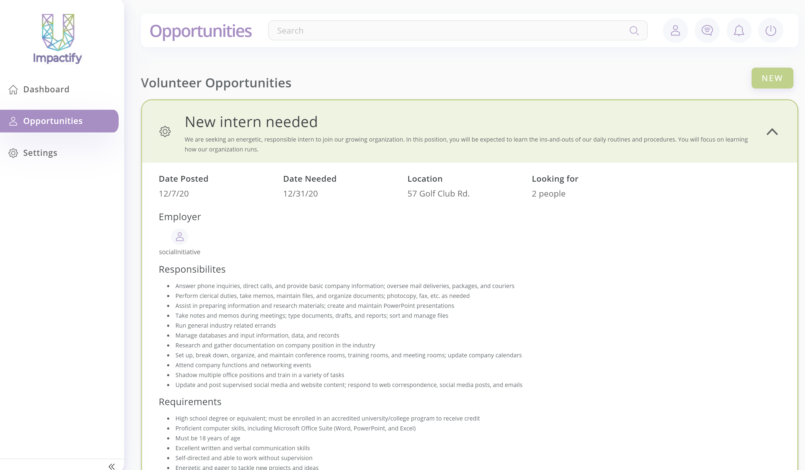

<!-- PROJECT LOGO -->
<br />

<p align="center">
  <a href="https://github.com/navn-r/uimpactify">
    
  </a>


  <h3 align="center">U Impactify</h3>

  <p align="center">
    This is U Impactify, the E-Learning website dedicated to serve the social purpose sector. Users can use this platform to develop their company's capacity, teach, and engage in various courses.
      <br/>
      <br/>
      Learn, Grow, and Give with Us
      <br/>
       <br/>
    <a href="https://uimpactify.herokuapp.com/dashboard">View Demo</a>
    ·
    <a href="https://github.com/navn-r/uimpactify/issues">Report Bug</a>
    ·
    <a href="https://github.com/navn-r/uimpactify/issues">Request Feature</a>
  </p>

</p>

<!-- TABLE OF CONTENTS -->

<details open="open">
  <summary><h2 style="display: inline-block">Table of Contents</h2></summary>
  <ol>
    <li>
      <a href="#about-the-project">About The Project</a>
      <ul>
        <li><a href="#built-with">Built With</a></li>
      </ul>
        <ul>
        <li><a href="#features">Features</a>
            <ul>
        		<li><a href="#asessments-/-courses-/-grading">Asessments / Courses / Grading</a></li>
                <li><a href="#survey-/-rating">Survey / Rating</a></li>
                <li><a href="#hiring-/-finding-opportunities">Hiring / Finding Opportunities</a></li>
                <li><a href="#real-time-chat">Real-Time Chat</a></li>
                <li><a href="#giving-garden-/-social-initiatives">Giving Garden / Social Initiatives</a></li>
      		</ul>
                </li>
      </ul>
    </li>
      <li><a href="#deployment-:rocket:">Deployment</a></li>
    <li>
      <a href="#getting-started">Getting Started</a>
      <ul>
        <li><a href="#prerequisites">Prerequisites</a></li>
        <li><a href="#installation">Installation</a></li>
      </ul>
    </li>
    <li><a href="#acknowledgements">Acknowledgements</a></li>
      <li><a href="#:smile:-memorable-quotes">Memorable Quotes</a></li>
  </ol>
</details>

<br/>

<!-- ABOUT THE PROJECT -->

## About The Project

<p align="center">
    

<br/>

<br/>

### Built With

* [MongoDB](https://www.mongodb.com/)
  * [GridFS](https://docs.mongodb.com/manual/core/gridfs/)
  * [Mongoose](https://mongoosejs.com/)
* [Express](https://expressjs.com/)
* [Angular](https://angular.io/)
* [Node](https://nodejs.org/en/)
* [Socket.io](https://socket.io/)
* [Chart.js](https://www.chartjs.org/)
* [ngx-file-drop](https://www.npmjs.com/package/ngx-file-drop)
* [Clarity](https://clarity.design/)
* [Figma](https://www.figma.com/)

<br/>

### Features

- #### Asessments / Courses / Grading

<p align="center">
    

- #### Survey / Rating

<p align="center">
    

- #### Hiring / Finding Opportunities

<p align="center">
    

<p align="center">
    

- #### Real-Time Chat

<p align="center">
    

- #### Giving Garden / Social Initiatives

<p align="center">
    

<!-- GETTING STARTED -->

<br/>

## Deployment :rocket:

### with Heroku at https://uimpactify.herokuapp.com/

<br/>

## Getting Started

To get a local copy up and running follow these simple steps.

### Prerequisites

This is an example of how to list things you need to use the software and how to install them.
* npm
  ```sh
  npm install npm@latest -g
  ```

### Installation

1. Clone the repo
   ```sh
   git clone https://github.com/navn-r/uimpactify
   ```
2. Install and Start the Project
   ```sh
   # frontend init.
   cd frontend
   npm install
   ng build --watch
   
   # backend init.
   cd ..
   cd backend
   npm install
   nodemon # or you can do npm start
   ```

<br/>

<!-- ACKNOWLEDGEMENTS -->

## Acknowledgements

#### Made with :heart: by Team :b:oundless

* [Clara Chick](https://github.com/KohinaTheCat)
* [Navinn Ravindaran](https://github.com/navn-r)
* [Samyak Mehta](https://github.com/Samyakk123)
* [Winson Yuan](https://github.com/booooper)
* [Divyam Patel](https://github.com/divyam-p)
* [Brian Kim](https://github.com/briankkim99)
* [Aryan Patel](https://github.com/AryPat)

<br/>

## :smile: Memorable Quotes 

> ##### Navinn: This could be done in an hour

> ##### Clara: This is gonna be a breeze

> ##### Samyak: Bro thats the coolest word in the world

> ##### Divyam:  Who deleted my apples?

<br/>

> ##### Swarup: your demo was pretty nice tbh.

> ##### Prof. Dema: Go second years go!

> ##### Gabrian: Great job boundless!

