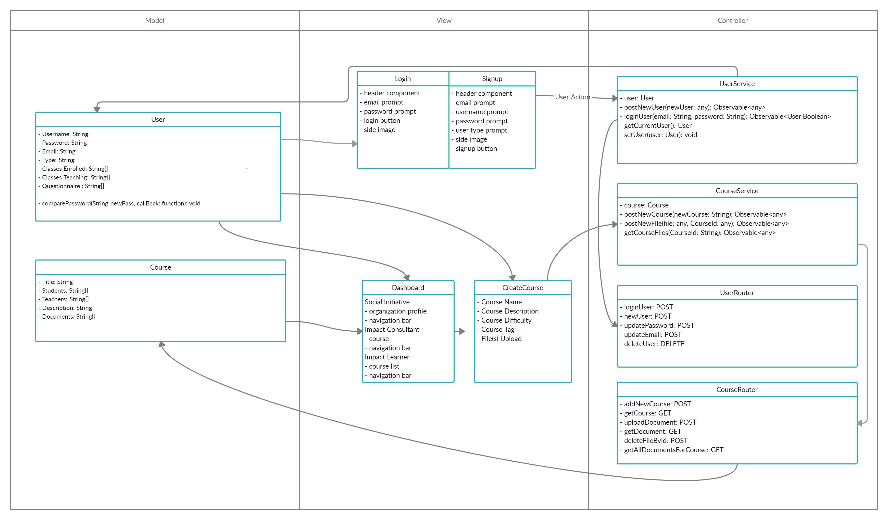

## CRC Cards


### **Frontend**

**Pages**

Login/Signup

```
Component name: LoginSignup

Parent class (if any): None
Subclasses (if any): None

Responsibilities: 
- Contains form for the user to submit their login/signup information
- Gives user the option to login/signup with other methods

Collaborators: 
- User (Services)
```

Questionaire 

```
Component name: Questionaire 

Parent class (if any): None
Subclasses (if any): None

Responsibilities: 
- Display questions based on the type of user you signup as
- Gather information based on questions submited

Collaborators:
- Users (Services)
```

Dashboard

```
Component name: Dashboard

Parent class (if any): None
Subclasses (if any): None

Responsibilities: 
- Display all pages
- Used to quickly navigate through different pages  

Collaborators: 
- User (Services)
```

Course

```
Component name: Course

Parent class (if any): None
Subclasses (if any): None

Responsibilities: 
- Display Course information 

Collaborators: 
- Course (Services)
```

Messaging Service 

```
Component name: Messaging  

Parent class (if any): None
Subclasses (if any): None

Responsibilities: 
- Send message to registered users 

Collaborators: 
- User (Services)
```

Feedback

```
Component name: Feedback  

Parent class (if any): None
Subclasses (if any): None

Responsibilities: 
- Display feedback for courses from registered users 

Collaborators: 
- User (Services)
```

Giving Garden 

```
Component name: Giving Garden  

Parent class (if any): None
Subclasses (if any): None

Responsibilities: 
- Donate money to a non-profit organization 
- Recieve Funding from individuals and larger organizations 
- Support Impact Learners in courses financially

Collaborators: 
- User (Services)
```


**Services**

```
Component name: User

Parent class (if any): None
Subclasses (if any): None

Responsibilities: 
- Create an account
- Delete an account
- Get current user informations

Collaborators: 
- User (from Backend)
```

```
Component name: Course

Parent class (if any): None
Subclasses (if any): None

Responsibilities: 
- Create a course 
- Modify a course 
- Delete a course 
- Post a file 
- Provide overview of course content

Collaborators:
- Course (From Backend)
```

**Components**

Dashboard Course Componenet (only for impact learner and impact consultant)

```
Component name: course 

Parent class (if any): None
Subclasses (if any): None

Responsibilities: 
- Display the courses the user is taking/teaching 
- Redirects you to create a course for easy access 

Collaborators: 
- User (Services)
```

Create Course

```
Component name: Create Course 

Parent class (if any): None
Subclasses (if any): None

Responsibilities: 
- Contains a form for the Instructor to create a new course

Collaborators: 
- Course (Service)
- User (Service)
```

Front Page Header 

```
Component name: Front Page Header 

Parent class (if any): None
Subclasses (if any): None

Responsibilities: 
- Display Sign-in and login-in buttons
- Easy accessible application infromation

Collaborators: 
- User (Service)
```

Footer 

```
Component name: Footer 

Parent class (if any): None
Subclasses (if any): None

Responsibilities: 
- Display contact information
- Links to social media accounts 
- Provide links to legal informations 

Collaborators: None
```

Global Search 

```
Component name: Global Search

Parent class (if any): None
Subclasses (if any): None

Responsibilities: 
- Search for Users
- Search for Courses
- Search for Document

Collaborators: None
```

**Guards**

```
Component name: Auth Guard 

Parent class (if any): None
Subclasses (if any): None

Resposiblity:
- Only logged in user are able to have access to the application

Collaborators: 
- User (Services)
```

**Backend**

User Routes 

```
Component name: User 

Parent class (if any): None
Subclasses (if any): None

Resposiblity:
- Get information from the database 
- Update information from the database

Collaborators: None
```

Course Routes

```
Component name: User 

Parent class (if any): None
Subclasses (if any): None

Resposiblity:
- Upload files and course information to the database 
- Recieve files and course information from the database

Collaborators: None
```


